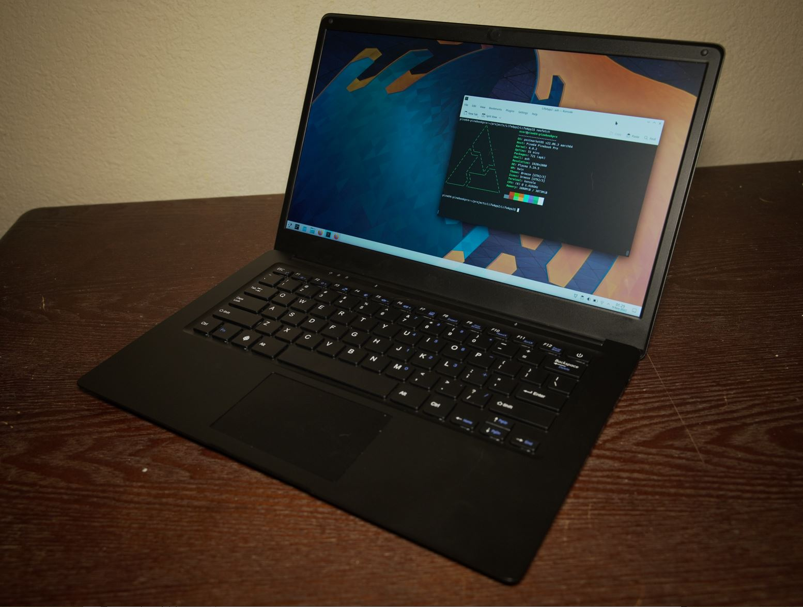

### About device

- great display
- decent keyboard
- terrible trackpad
  - clicking
  - software inaccuracy (can be improved)
- body is okay with metal, without metal just weak plastic
- what's also not great is the system LEDs are software-based
  eg. need working boot to see any indication something's happening

### Opinion on OS's

#### Alpine Linux/PostmarketOS v22.06

- Pros
  - boots eMMC
  - better mouse performance
- Cons
  - No VS Code sucks due to Alpine using `musl libc` vs. `gibc`
    - using Kate to write this now
  - issue with Tauri, this `dbus-1` thing

- Plasma KDE
  - Pros
    - nice looking, file manager works as you expect eg. drag folder into places
  - Cons
    - lag, click some UI thing takes a few seconds to appear
    - this KDE wallet thing, annoying, WiFi does not reconnect

- i3 (broken)

- General hardware
  - as is the setup does not suspend/hibernate when closing the lid
    overnight the battery loses 50% of charge

#### Kali 2022.3

- Pros
  - boots eMMC
- Cons
  - No WiFi (in base image)

#### Armbian `22.08.7 jammy_edge 5.19.16`

- Pros
  - boots eMMC
- Cons
  - does not get past `initramfs`
