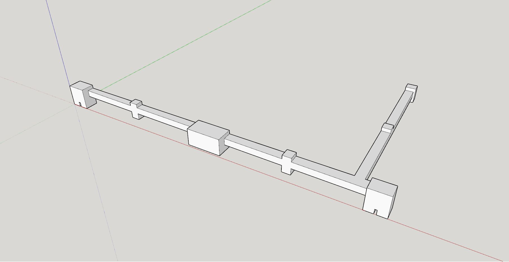
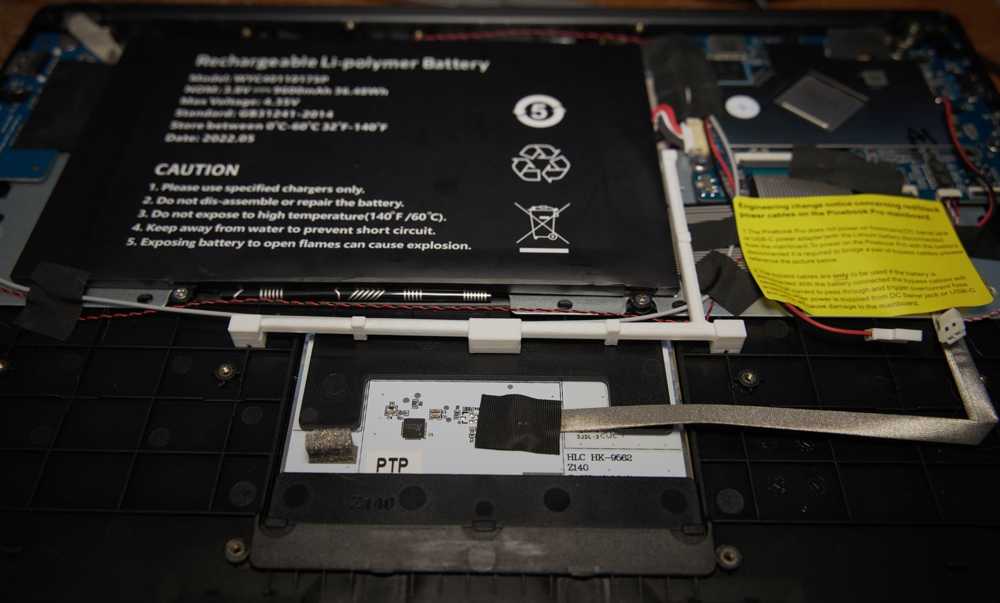

### About

The middle of the keyboard area (near top-right of mousepad) sags if you push down on it.

The keyboard feels more mushy than it is as you type/rest your palm over that area.

So I'll come up with an internal support design, factoring in NVME

### No glue required, just clamps on

#### Design

#### Actual

