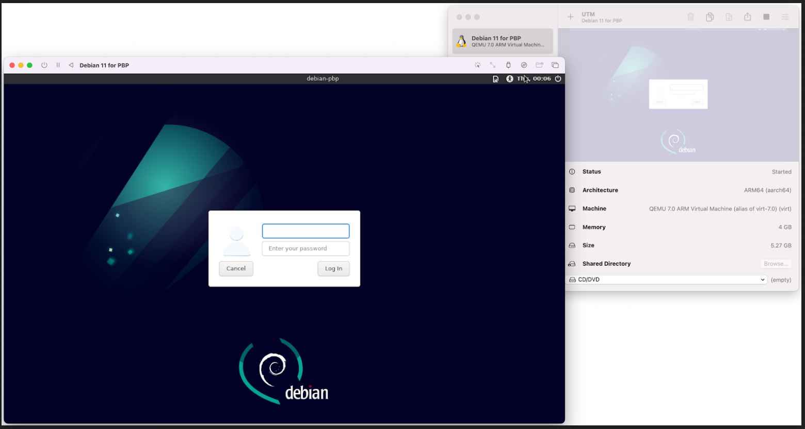

https://github.com/pyavitz/debian-image-builder

ah shit... can't do it here lol

"what OS are you running?" I'm using Alpine

I guess I'll bust out my pinephone pro again

well that was not helpful, not sure if I'm supposed to be running Debian to make a Debian image.

I'm loading up QEMU on my x64 Win 10 desktop, so I can load an Arm64 Debian host.

Trying to find an arm64 debian image for QEMU

good god... I can't figure out this Qemu setup on Windows 10 lol I'm a noob I need pictures (GUI)

Going to try Mac since for Mac M1 anyway I've used a Qemu GUI before.

Doing this on my 2015 MBP

damn still building some minutes later

i7

8:17 PM

okay got it, said to install python3 too

wtf says qemu not found lol

Oh my bad, I misremembered I used UTM

You could print the entire top case, fit a new keyboard, maybe use serial, that would be interesting...

not sure about track pad, less you pass it as PS2 lol

Out of my depth for sure, also need to make sure it's structural/closes safely still.

Nice this is cool, I just hope it works.

Trying graphical install

Oh damn my Mac's screen turned off lol maybe just battery

No it's at 72% weird... fans were going nuts for a bit

Once I make the image will sftp it to an RPi and download it back to Win 10

This is taking a bit... going to cook, watch my Andor ep

9:26 PM

damn this install is cooking my MBP

10:10 PM

it's still going... I'm on `select and install software`

10:23 PM

Installing desktop environment and what not

10:45 PM

ohhh man... it's possible this won't finish before I have to go to sleep

not sure if I should have increased the core count or if it's the emulation

11:19 PM

damn if it goes to sleep (display) it stops working completely ugh...

12:01 AM

my god... finally over wow

more than 2 hours, that ain't right

damn it is slow though

right now I don't have an Arm-based computer (other than PBP/PPP) that is mine (haha work M1).

So I'll commit to this even if it takes a whle

Damn... it's taking a long ass time just to bring the desktop up this might have been a waste of time idk. I'll see if I can improve other settings to make it better.

Adding more cores, not sure if using something other than arm7 would help...

I wonder if I messed up the install somehow, I chose Debian desktop and XFCE... tried both not seeing anything on GUI

oh... you have to lock the mouse cursor for it to detect something's happening... or maybe it was a coincidence lol

it's pretty snappy now

this is murdering my mbp though fans on constantly and fast

it's working though, I'll have to try this build tomorrow

this is not usable... I mean I'm looking at firefox but the lag...

I have a RPi 4 I forgot

I can get a desktop on there, I think Arm V8 is Arm 64