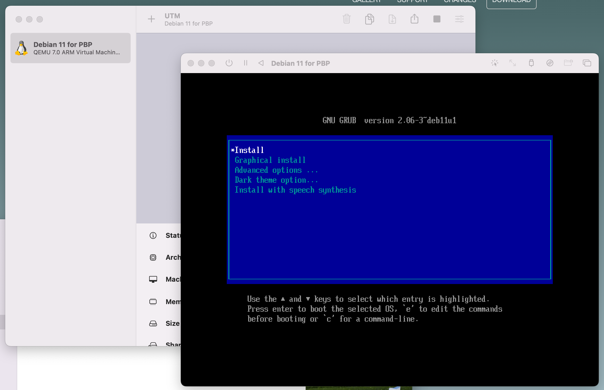

https://github.com/pyavitz/debian-image-builder

ah shit... can't do it here lol

"what OS are you running?" I'm using Alpine

I guess I'll bust out my pinephone pro again

well that was not helpful, not sure if I'm supposed to be running Debian to make a Debian image.

I'm loading up QEMU on my x64 Win 10 desktop, so I can load an Arm64 Debian host.

Trying to find an arm64 debian image for QEMU

good god... I can't figure out this Qemu setup on Windows 10 lol I'm a noob I need pictures (GUI)

Going to try Mac since for Mac M1 anyway I've used a Qemu GUI before.

Doing this on my 2015 MBP

damn still building some minutes later

i7

8:17 PM

okay got it, said to install python3 too

wtf says qemu not found lol

Oh my bad, I misremembered I used UTM

You could print the entire top case, fit a new keyboard, maybe use serial, that would be interesting...

not sure about track pad, less you pass it as PS2 lol

Out of my depth for sure, also need to make sure it's structural/closes safely still.

Nice this is cool, I just hope it works.

Trying graphical install

Oh damn my Mac's screen turned off lol maybe just battery

No it's at 72% weird... fans were going nuts for a bit

Once I make the image will sftp it to an RPi and download it back to Win 10

